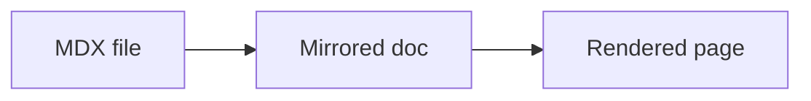

# MDX styling standard

## Current styling pipeline

### App-wide styling

- The app uses plain CSS.
- Global theme tokens come from [src/styles/starlight-base.css](/home/joseph/work/render-mdx/src/styles/starlight-base.css).
- Global app overrides and custom component styles live in [src/styles/custom.css](/home/joseph/work/render-mdx/src/styles/custom.css).
- Starlight also contributes its own built-in global layers for layout, prose, asides, tabs, cards, file trees, and code presentation.
- Route-specific layout tweaks live in Astro component `<style>` blocks in:
  - [src/components/CustomPageFrame.astro](/home/joseph/work/render-mdx/src/components/CustomPageFrame.astro)
  - [src/components/CustomPageSidebar.astro](/home/joseph/work/render-mdx/src/components/CustomPageSidebar.astro)
  - [src/components/CustomMarkdownContent.astro](/home/joseph/work/render-mdx/src/components/CustomMarkdownContent.astro)

### Root page before the fix

- The root route at [src/pages/index.astro](/home/joseph/work/render-mdx/src/pages/index.astro) manually imported `starlight-base.css`, Starlight’s markdown CSS, and `custom.css`.
- It rendered a standalone HTML document instead of using the Starlight page shell.
- The file picker UI in [src/components/SourcePicker.astro](/home/joseph/work/render-mdx/src/components/SourcePicker.astro) was styled by a large `.picker*` section in `custom.css` with its own hardcoded colors, backgrounds, spacing, and typography.

### Rendered document pages

- Rendered documents are mirrored into the Starlight `docs` content collection by [render_mdx/cli.py](/home/joseph/work/render-mdx/render_mdx/cli.py:214).
- The original MDX source stays outside this repo. The renderer stores registered file paths, then mirrors those files into the app at runtime.
- Astro/Starlight loads those mirrored files through [src/content.config.ts](/home/joseph/work/render-mdx/src/content.config.ts:1).
- The rendered doc route uses the Starlight shell configured in [astro.config.mjs](/home/joseph/work/render-mdx/astro.config.mjs:1), including:
  - `PageFrame` override
  - `PageSidebar` override
  - `MarkdownContent` override
  - shared `custom.css`
- Mermaid is not a React/Astro component. It is a fenced-code enhancement added by [src/plugins/rehypeMermaidBlocks.mjs](/home/joseph/work/render-mdx/src/plugins/rehypeMermaidBlocks.mjs) and rendered by [src/components/CustomMarkdownContent.astro](/home/joseph/work/render-mdx/src/components/CustomMarkdownContent.astro).

## Root cause of the inconsistency

- The root page was not using the same page shell as rendered docs.
- The root page relied on a separate visual language implemented in `.picker*` styles with fixed light-theme values.
- The rendered doc pages used Starlight’s layout, tokens, and built-in component styling.
- Result: same CSS files were partially shared, but the two routes were effectively separate UIs.

## Chosen convention

### Recommendation

Use **Option A**.

- Styling should live in the shared app/component layer, not in individual MDX files.
- In this stack, the stable styling primitives are:
  - Starlight theme tokens
  - shared global CSS in `src/styles/custom.css`
  - Starlight MDX components
  - repo-level MDX exports from `@mdx-components`

This is the best fit because rendered MDX files are mirrored from arbitrary local paths into `docs/rendered/`. Per-file styling would be brittle, repetitive, and hard to keep consistent across mirrored documents.

### Rule going forward

- Do not put visual styling in MDX files except for truly one-off content cases.
- Prefer shared MDX components imported from `@mdx-components`.
- If a new presentation pattern is needed, add it once in the app layer and expose it through `@mdx-components`.
- Keep route-level layout styling in app CSS or Astro layout components, not inside MDX content.

## Available MDX components

### Import surface

Use this import in MDX files:

```mdx
import {
  Aside,
  Badge,
  Card,
  CardGrid,
  Code,
  FileTree,
  Icon,
  LinkButton,
  LinkCard,
  Steps,
  TabItem,
  Tabs,
} from '@mdx-components';
```

That alias is defined in [astro.config.mjs](/home/joseph/work/render-mdx/astro.config.mjs:1) and re-exported from [src/components/mdx/index.ts](/home/joseph/work/render-mdx/src/components/mdx/index.ts:1).

### `Aside`

Props:

- `type`: `note | tip | caution | danger` default `note`
- `title?`
- `icon?`

Example:

```mdx
<Aside type="tip" title="Authoring hint">
  Prefer shared components over ad hoc inline styling.
</Aside>
```

Starlight also supports directive syntax:

```md
:::note
This also renders as an aside.
:::
```

### `Badge`

Props:

- `text`
- `variant`: `default | note | danger | success | caution | tip`
- `size`: `small | medium | large`

Example:

```mdx
<Badge text="Stable" variant="success" size="medium" />
```

### `Card`

Props:

- `title`
- `icon?`

Example:

```mdx
<Card title="Shared styling" icon="notes">
  Component presentation is defined once in the app layer.
</Card>
```

### `CardGrid`

Props:

- `stagger?` boolean

Example:

```mdx
<CardGrid stagger>
  <Card title="Browse" icon="open-book">Pick a file.</Card>
  <Card title="Render" icon="rocket">Open the rendered route.</Card>
</CardGrid>
```

### `LinkCard`

Props:

- `title`
- `description?`
- standard anchor props like `href`

Example:

```mdx
<LinkCard
  title="Open styling standard"
  description="Read the shared MDX authoring rules."
  href="/"
/>
```

### `LinkButton`

Props:

- `href`
- `icon?`
- `iconPlacement?`: `start | end`
- `variant?`: `primary | secondary | minimal`

Example:

```mdx
<LinkButton href="/" icon="left-arrow" iconPlacement="start" variant="secondary">
  Back to picker
</LinkButton>
```

### `Tabs` and `TabItem`

`Tabs` props:

- `syncKey?`

`TabItem` props:

- `label`
- `icon?`

Example:

````mdx
<Tabs syncKey="language">
  <TabItem label="TypeScript">
    ````ts
    console.log('hello');
    ````
  </TabItem>
  <TabItem label="Python">
    ````py
    print("hello")
    ````
  </TabItem>
</Tabs>
````

### `Steps`

Slot contract:

- content must be a single ordered list

Example:

```mdx
<Steps>
  1. Save an `.mdx` file.
  2. Open it from the picker.
  3. Refresh if the render is still pending.
</Steps>
```

### `FileTree`

Slot contract:

- content must be a single unordered list

Example:

```mdx
<FileTree>
  - src/
    - components/
      - mdx/
        - index.ts
</FileTree>
```

### `Icon`

Props:

- `name`
- `label?`
- `color?`
- `size?`

Example:

```mdx
<p><Icon name="rocket" /> Render pipeline</p>
```

### `Code`

- Re-exported from `astro-expressive-code/components`
- Use when you need the component form instead of fenced code blocks

Example:

```mdx
<Code code={`npm run dev`} lang="bash" />
```

### Mermaid fenced blocks

- No import required
- Any fenced block with language `mermaid` is transformed by the app plugin
- Styling and interactivity live in [src/components/CustomMarkdownContent.astro](/home/joseph/work/render-mdx/src/components/CustomMarkdownContent.astro)

Example:

````md

````

## What changed in the app

- The home page now renders inside Starlight’s page shell instead of a standalone HTML document.
- Shared theme tokens now drive both the picker UI and MDX component styling.
- A stable `@mdx-components` import surface now exists for future MDX authoring.
- Built-in MDX components and Mermaid output now inherit the same visual system as the home page.
