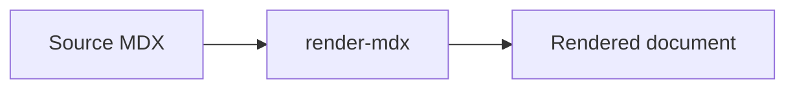

# render-mdx Components

Use this skill when an agent is writing an MDX document that will be viewed through render-mdx. The document’s topic does not matter; this skill is about authoring portable MDX that renders cleanly with render-mdx.

Do not use this skill merely because the agent is changing the render-mdx codebase. Repo maintenance, component implementation, packaging, and CLI changes are outside this skill unless the task also involves authoring a rendered MDX document.

## Register this skill

This package stores the skill at `render_mdx/skills/render-mdx-components/` so it can ship with the CLI. To install it into another project:

```bash
render-mdx install-skill /path/to/project
```

This creates `/path/to/project/.agents/skills/render-mdx-components/`. Omit the project path to target the current directory. Use `--force` only when replacing an existing installed copy is intentional.

Completion criterion: the installed path contains `SKILL.md` at the skill directory root and the skill appears in the available-skills list on a new session.

## Use existing MDX components first

In a rendered MDX document, import available Starlight components from the render-mdx alias:

```mdx
import {
  Aside,
  Badge,
  Card,
  CardGrid,
  Code,
  CodeWalkthrough,
  CodeWalkthroughStep,
  FileTree,
  Icon,
  LinkButton,
  LinkCard,
  Steps,
  TabItem,
  Tabs,
} from '@mdx-components';
```

Prefer these components over inline styles or ad hoc HTML. Mermaid diagrams do not need an import; fenced `mermaid` code blocks are handled by the renderer.

Completion criterion: the MDX uses `@mdx-components` for supported presentation patterns and avoids per-document styling unless it is a deliberate one-off content exception.

## Authoring rules

- Keep styling out of the MDX document when a Starlight/render-mdx component can express the structure.
- Use `Aside` for callouts. Its `type` must be `note`, `tip`, `caution`, or `danger`; use `caution` for warnings because Starlight does not accept `warning`.
- Use `Steps` for ordered procedures.
- Use `CardGrid` and `Card` for grouped options or navigation-style summaries.
- Use `Tabs` and `TabItem` for parallel variants such as OS-specific commands.
- Use `FileTree` for directory structures.
- Use `CodeWalkthrough` with `CodeWalkthroughStep` when prose should explain specific line ranges in one source file.
- Use fenced code blocks for normal code samples.
- Use fenced `mermaid` blocks for diagrams.

Completion criterion: the document remains readable as source text and uses render-mdx/Starlight primitives instead of custom local presentation code.

## Minimal examples

Use an aside:

```mdx
<Aside type="tip" title="Authoring hint">
  Prefer shared components over inline styling.
</Aside>
```

Use steps:

```mdx
<Steps>
1. Register the document.
2. Open render-mdx.
3. Review the rendered output.
</Steps>
```

Use a guided code walkthrough:

```mdx
<CodeWalkthrough filename="src/request.ts" lang="ts" code={`const input = read();\nvalidate(input);\nsave(input);`}>
  <CodeWalkthroughStep title="Validate first" lines="1-2">
    Parse and validate the input before any write occurs.
  </CodeWalkthroughStep>
  <CodeWalkthroughStep title="Persist valid input" lines={3}>
    The final line performs the side effect.
  </CodeWalkthroughStep>
</CodeWalkthrough>
```

`lines` is one-based and accepts a number, an array of numbers, or comma-separated
ranges such as `"2-5,8"`. Keep each step focused on the smallest useful range.

Use a Mermaid diagram:

````md

````

## Register a source path

Use the CLI when the MDX or Markdown document should be saved in render-mdx without starting the web UI:

```bash
render-mdx register ./docs/example.mdx
render-mdx register ./docs
```

`render-mdx add ./docs/example.mdx` is an alias. A registered directory includes
its `.md` and `.mdx` documents recursively and picks up new documents while the
renderer is running. Starting the renderer with paths still works and also
registers them:

```bash
render-mdx ./docs/example.mdx
```

The registry accepts `.md` and `.mdx` files or directories, and rejects missing
paths and files with other extensions. Recursive directory scans skip nested
hidden paths, symlink entries, and `node_modules`. Use
`RENDER_MDX_HOME=/tmp/render-mdx-test` during tests or smoke checks so user state
is not modified.

Completion criterion: any command that mutates the registry targets the intended
`$RENDER_MDX_HOME`/`~/.render-mdx` state, and the registered path resolves to an
existing file or directory.

## Verification

When the task includes validation, prefer a render smoke check:

```bash
render-mdx register ./docs/example.mdx
render-mdx
```

If the check must avoid user state, set `RENDER_MDX_HOME` to a temporary directory.

Completion criterion: the final response states which MDX file changed, which render-mdx components were used, and whether the document path was registered or smoke-checked.
